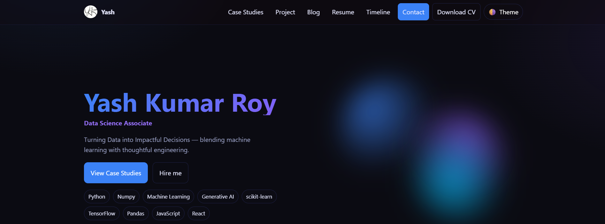

# 🌐 Personal Portfolio - Yash Kumar Roy

Welcome to the repository for my **personal portfolio website**!  
This site showcases my **skills, projects, and experience** in **Machine Learning, Data Science, and Web Development**.  
It’s designed with a **futuristic, tech-inspired theme** to reflect my passion for AI and modern technologies.  

🔗 **Live Site:** [yash-kumar-roy.github.io/yashkumarroy](https://yash-kumar-roy.github.io/yashkumarroy)

---

## 🚀 Features

- **Responsive Design** – Works seamlessly across devices  
- **Navigation Bar** – Quick access to GitHub, LinkedIn, and Resume  
- **Projects Showcase** – Highlighting my key work in ML, AI, and Data Science  
- **Tech Stack Section** – My core skills:  
  - Machine Learning 🤖  
  - Deep Learning 🧠  
  - Python 🐍  
  - Generative AI ✨  
  - MySQL 🗄️  

---

## 🛠️ Tech Stack

- **Frontend:** HTML, CSS, JavaScript  
- **Styling:** Futuristic & tech-themed CSS  
- **Deployment:** GitHub Pages  

---

## 📂 Repository Structure

```plaintext
yashkumarroy/
├── index.html       # Main landing page
├── assets/          # Images, icons, and other resources
├── css/             # Stylesheets
├── js/              # JavaScript files
└── README.md        # Project documentation

```
---

## ⚙️ Setup & Installation
To run this project locally:

```bash
# Clone the repository
git clone https://github.com/yash-kumar-roy/yashkumarroy.git

# Navigate to the project folder
cd yashkumarroy

# Open index.html in your browser
No additional dependencies are required since this is a static site.

```

## 🚀 Usage
- Simply open the site link: [Portfolio Live](https://yash-kumar-roy.github.io/yashkumarroy/).
- Navigate through different sections (Projects, Resume, Skills).
- Bookmark the site for quick access.

## 🔍 SEO & Performance
#### The site includes:
- Meta tags for description, author, and viewport.
- Open Graph tags for link previews.
- Favicon support for brand identity.
- Lightweight assets for faster loading.

## 🌎 Deployment
### This project is deployed using GitHub Pages.
### Steps followed:
1. Pushed code to ```main``` branch.
2. Enabled GitHub Pages under repository settings.
3. Live site hosted at: ```https://yash-kumar-roy.github.io/yashkumarroy/```

## 📬 Contact
### 👤 Yash Kumar Roy
- GitHub: `@yash-kumar-roy`
- Portfolio: [Live Website](https://yash-kumar-roy.github.io/yashkumarroy/)
- LinkedIn: [Yash Kumar Roy](https://www.linkedin.com/in/yashkumarroy/)
- Email: yashkumarroy164@gmail.com


